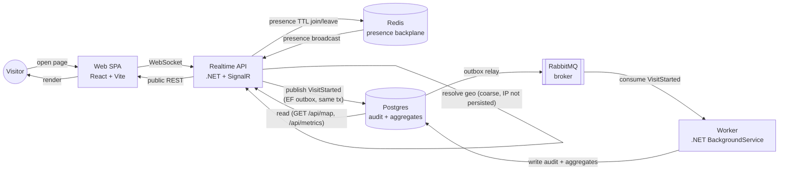

# Pulse

[](https://github.com/felipe-allmeida/pulse/actions/workflows/ci.yml)
[](https://github.com/felipe-allmeida/pulse/actions/workflows/deploy.yml)

**A live, real-time system embedded in a portfolio.** Open the page and you see
who else is there right now (presence), a live world map of where visitors are
connecting from, and the system's own public metrics — updating in real time,
in your browser. The "cool" surface is a thin client for a real distributed,
event-driven, observable, infrastructure-as-code-deployed backend, built to be
a legitimate senior/staff engineering artifact, not a toy demo.

## Live demo

`https://pulse.<domain>` — **coming soon.** The URL is assigned once the owner
provisions DNS for the deployed Hetzner box (see [Deploy](#deploy) below); no
placeholder or fake domain is linked here yet.

## Architecture



Presence is entirely Redis-backed and TTL-pruned — a client that disconnects
uncleanly (crashed tab, dropped WiFi) simply stops being counted once its
heartbeat expires, no explicit cleanup path required. The visit-audit path is
fully event-driven: the API never writes to Postgres directly for a visit —
it publishes `VisitStarted` through MassTransit's EF transactional outbox (so
the publish and any business write commit atomically), the outbox relay hands
it to RabbitMQ, and a separate Worker process consumes it, resolves the
durable write, and updates aggregates. The API and Worker never call each
other directly; RabbitMQ is the only coupling.

| Component | Responsibility | Stack |
|---|---|---|
| **Web** | Portfolio SPA: presence layer, world map, live metrics widgets | React 19 + Vite + TypeScript |
| **Realtime API** | WebSocket hub (presence join/leave, reactions), coarse geo resolution, public REST reads | .NET 10 + SignalR |
| **Redis** | Presence backplane — TTL-based sorted set, self-heals on disconnect, backs SignalR's own scale-out backplane | Redis 7 |
| **RabbitMQ** | Event broker between API and Worker, fed by the EF transactional outbox | RabbitMQ 3 (management) |
| **Worker** | Consumes `VisitStarted`, writes the audit row, updates aggregates | .NET 10 BackgroundService |
| **Postgres** | Durable store: visit audit log, aggregates read by the public endpoints | Postgres 17, EF Core (snake_case) |
| **OTel** | Traces + metrics from the API, exported via OTLP | OpenTelemetry |
| **Caddy** | Reverse proxy in front of the stack, automatic TLS via Let's Encrypt | Caddy |
| **Terraform** | Provisions the Hetzner box, firewall, and installs Docker + Portainer | Terraform (Hetzner) |

## Tech stack

- **Backend:** .NET 10, ASP.NET Core, SignalR (+ Redis backplane for scale-out)
- **Messaging:** MassTransit + RabbitMQ, EF Core transactional outbox
- **Data:** EF Core + PostgreSQL (`UseSnakeCaseNamingConvention`), Redis (presence)
- **Observability:** OpenTelemetry (traces + metrics, OTLP export)
- **Frontend:** React 19, Vite, TypeScript, `@microsoft/signalr` client
- **Infra:** Docker, Docker Compose, Caddy (TLS), Terraform (Hetzner Cloud + Portainer CE)
- **CI/CD:** GitHub Actions → GHCR → Portainer stack webhook
- **Testing:** xUnit, Testcontainers (Postgres + Redis + RabbitMQ spun up per test run)

## Privacy by design

Privacy is treated as a feature, not an afterthought — this system is built
with a European/GDPR-conscious audience in mind:

- **Coarse geo only.** The API resolves country/city (and an approximate
  lat/lon) from the connecting IP using a local MaxMind GeoLite2 database.
  That's the only use the IP is ever put to.
- **The raw IP is never persisted, never queued, never broadcast.** It exists
  only as a transient local variable for the duration of the lookup call. The
  `VisitStarted` domain event that crosses the outbox → RabbitMQ → Worker →
  Postgres boundary has **no IP field at all** — the constraint is enforced
  at the type level, not by convention or redaction:
  ```csharp
  public sealed record VisitStarted(
      Guid VisitId, string ConnectionId,
      string Country, string City, double Lat, double Lon,
      DateTimeOffset OccurredAt);
  ```
- **No GeoLite2 database, no geo.** If the deployment has no `.mmdb` file
  configured, the API falls back to a null geolocator and every visit
  resolves to `"Unknown"` — the system degrades safely rather than reaching
  out to a third-party geo API with visitor IPs.
- **Presence is ephemeral by construction.** Who's online lives only in a
  Redis TTL set; there is no durable record of *which* connections were
  present, only aggregate counts.

## Run locally

```bash
docker compose -f deploy/compose.yml up --build
```

Then open `http://localhost`. This brings up Postgres, Redis, RabbitMQ, the
API, the Worker, and Caddy in front of the built web app, with local-dev
defaults for every credential (override via a repo-root `.env`, gitignored).

No GeoLite2 `.mmdb` is bundled with the repo (it's a licensed MaxMind
download, not something to commit), so **geo shows "Unknown" locally** unless
you mount your own database — see the comment above the `api` service in
`deploy/compose.yml` for how to point `Geo__DbPath` at one.

**Tests:**

```bash
dotnet test                # backend: xUnit unit + Testcontainers integration tests
pnpm -C web build           # frontend: typecheck + production build
```

## Deploy

The deployed target is a single Hetzner Cloud VM, provisioned with Terraform
and running the stack under Portainer — see [`infra/README.md`](infra/README.md)
for the full apply/DNS/access walkthrough.

CI/CD flow: GitHub Actions builds and tests on every PR, and on push to `main`
builds the `api`/`worker`/`web` images, pushes them to GHCR, then calls a
Portainer stack webhook so the running stack redeploys with the new images.
That webhook URL is supplied via the repo secret `PORTAINER_WEBHOOK`; if it's
unset, the redeploy step logs and no-ops rather than failing the pipeline.

## Status

Phase 1 (MVP): presence, live world map, public metrics, ephemeral reactions,
deployed via IaC + CI/CD, covered by OTel and Testcontainers-backed tests.
A persistent reactions canvas, a public geo-audit feed UI, and an
`/architecture` page with ADRs are scoped for later phases and not part of
this build.
