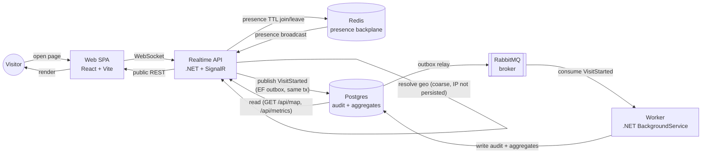

# Pulse

[](https://github.com/felipe-allmeida/pulse/actions/workflows/ci.yml)
[](https://github.com/felipe-allmeida/pulse/actions/workflows/deploy.yml)

**A live, real-time system embedded in a portfolio.** Open the page and you see
who else is there right now (presence), a live world map of where visitors are
connecting from, and the system's own public metrics — updating in real time,
in your browser. The "cool" surface is a thin client for a real distributed,
event-driven, observable, infrastructure-as-code-deployed backend, built to be
a production-grade engineering reference, not a toy demo.

## Live demo

`https://pulse.<domain>` — **coming soon.** The URL is assigned once the owner
provisions DNS for the deployed Hetzner box (see [Deploy](#deploy) below); no
placeholder or fake domain is linked here yet.

## Architecture



Presence is entirely Redis-backed and TTL-pruned — a client that disconnects
uncleanly (crashed tab, dropped WiFi) simply stops being counted once its
heartbeat expires, no explicit cleanup path required. The visit-audit path is
fully event-driven: the API never writes to Postgres directly for a visit —
it publishes `VisitStarted` through MassTransit's EF transactional outbox (so
the publish and any business write commit atomically), the outbox relay hands
it to RabbitMQ, and a separate Worker process consumes it, resolves the
durable write, and updates aggregates. The API and Worker never call each
other directly; RabbitMQ is the only coupling.

| Component | Responsibility | Stack |
|---|---|---|
| **Web** | Portfolio SPA: presence layer, world map, live metrics widgets | React 19 + Vite + TypeScript |
| **Realtime API** | WebSocket hub (presence join/leave, reactions), coarse geo resolution, public REST reads | .NET 10 + SignalR |
| **Redis** | Presence backplane — TTL-based sorted set, self-heals on disconnect, backs SignalR's own scale-out backplane | Redis 7 |
| **RabbitMQ** | Event broker between API and Worker, fed by the EF transactional outbox | RabbitMQ 3 (management) |
| **Worker** | Consumes `VisitStarted`, writes the audit row, updates aggregates | .NET 10 BackgroundService |
| **Postgres** | Durable store: visit audit log, aggregates read by the public endpoints | Postgres 17, EF Core (snake_case) |
| **OTel** | Traces + metrics from the API, exported via OTLP | OpenTelemetry |
| **Caddy** | Reverse proxy in front of the stack, automatic TLS via Let's Encrypt | Caddy |
| **Terraform** | Provisions the Hetzner box, firewall, and installs Docker + Portainer | Terraform (Hetzner) |

## Tech stack

- **Backend:** .NET 10, ASP.NET Core, SignalR (+ Redis backplane for scale-out)
- **Messaging:** MassTransit + RabbitMQ, EF Core transactional outbox
- **Data:** EF Core + PostgreSQL (`UseSnakeCaseNamingConvention`), Redis (presence)
- **Observability:** OpenTelemetry (traces + metrics, OTLP export)
- **Frontend:** React 19, Vite, TypeScript, `@microsoft/signalr` client
- **Infra:** Docker, Docker Compose, Caddy (TLS), Terraform (Hetzner Cloud + Portainer CE)
- **CI/CD:** GitHub Actions → GHCR → Portainer stack webhook
- **Testing:** xUnit, Testcontainers (Postgres + Redis + RabbitMQ spun up per test run)

## The visitor moment

The hero opens by telling you something true about your own arrival — *"You're
in Porto Alegre — and the first person from there ever to open this page. That
pulsing dot behind this text is you."* No cookie, no permission prompt, no
click.

It runs on the visit history the Worker has been writing all along:
`GET /api/visitor` returns the caller's coarse geo plus the counts around it,
and the client picks the most striking fact that happens to be true right now —
first ever from your city, first in N days, a round-numbered arrival, the nth
person in the last 24 hours, or who came before you and from where. There is
always a true fact left (`position`), so the line never comes up empty, and a
reload steps to the next one down the list instead of repeating itself.

Deliberate constraints, because this is a portfolio and not a party trick:

- **It never guesses.** Without a resolved city, every city-based fact drops
  out and the copy uses its city-less form. Nothing is invented to fill a slot.
- **It never claims a dot that isn't drawn.** The "that's you" clause only
  renders when the visitor actually has a point on the map.
- **It says nothing personal to a crawler**, or before `/api/visitor` answers —
  both get the generic hook.
- **It stays in intervals, not calendar days** ("in the last 24 hours", "3
  hours ago"), because the server can't see the visitor's timezone.
- **It reads nothing new about you.** Everything on that line comes from the
  same coarse geo the map already used; no fingerprinting, no extra signal
  collection, no client-side probing.

### `/watched` — the long version

A quiet "How do I know that?" link under the hero opens the full page, so the
reveal is opt-in rather than an ambush. It escalates — the whole stack of true
history facts, then the readings the browser volunteers with no prompt
(language, timezone, screen, cores, touch, DNT), then those common traits
multiplied into a "1 in N" — and then turns hard into what this system
actually keeps: the `VisitStarted` record with no IP field, the Redis TTL that
erases presence on its own, and a link to `/live`.

The turn is the point. A reveal that stops at "look what I can see" is an
argument about surveillance; ending on the record that *cannot* carry an IP
makes it an argument about engineering.

What it deliberately does not do, though all of it would work: no WebRTC
public-IP discovery, no canvas/WebGL/audio hashing or font probing, no stored
fingerprint, no persistence of any kind. The digest it displays is computed for
the reader to look at and thrown away — there is no second-visit recognition,
which is exactly what the copy claims. Only one rarity row (`city`) is real
data, measured from this site's own history; the rest are labelled estimates,
and the page states plainly that multiplying them overstates uniqueness because
the dimensions aren't independent.

## Privacy by design

Privacy is treated as a feature, not an afterthought — this system is built
with a European/GDPR-conscious audience in mind:

- **Coarse geo only.** The API resolves country/city (and an approximate
  lat/lon) from the connecting IP using a local IP-to-city database (DB-IP
  Lite by default; any MaxMind-format `.mmdb` works). That's the only use the
  IP is ever put to.
- **The raw IP is never persisted, never queued, never broadcast.** It exists
  only as a transient local variable for the duration of the lookup call. The
  `VisitStarted` domain event that crosses the outbox → RabbitMQ → Worker →
  Postgres boundary has **no IP field at all** — the constraint is enforced
  at the type level, not by convention or redaction:
  ```csharp
  public sealed record VisitStarted(
      Guid VisitId, string ConnectionId,
      string Country, string City, double Lat, double Lon,
      DateTimeOffset OccurredAt);
  ```
- **No geo database, no external lookup.** If the deployment has no `.mmdb`
  file configured, the API resolves geo from a local demo fallback (a synthetic
  spread across real cities, the default) — or `"Unknown"` if that's disabled
  (`Geo:DemoFallback=false`). Either way it degrades safely rather than reaching
  out to a third-party geo API with visitor IPs.
- **Presence is ephemeral by construction.** Who's online lives only in a
  Redis TTL set; there is no durable record of *which* connections were
  present, only aggregate counts.

## AI assistant

A floating chat widget lets a recruiter ask questions about Felipe — "Does
he have Kubernetes experience?", "What's he working on now?" — and get a
streamed, grounded answer instead of skimming a CV.

- **Grounded, not a general chatbot.**
  [`src/Pulse.Api/Assistant/profile.md`](src/Pulse.Api/Assistant/profile.md)
  is the **single curated source** the assistant knows about Felipe —
  experience, skills, projects, an FAQ. The system prompt restricts answers
  to that file's content (third person, English) and the file is meant to be
  edited freely as things change; there's no other data source, no resume
  upload, no web lookup.
- **Streamed.** `POST /api/ask` streams the response token-by-token over the
  wire so the widget renders it incrementally, like a normal chat reply.
- **Keyless-graceful.** With no OpenAI API key configured, the API still
  boots and `/api/ask` still responds — it just replies that the assistant
  isn't configured yet, instead of erroring or refusing to start.
- **Capped by design.** A per-IP rate limit, a per-day question cap, and
  caps on question length / conversation history / output tokens keep a
  single visitor (or a bot) from running up API spend.

**Config** (all under `OpenAI__*` / `Ask__*`, e.g. as environment variables
or in `appsettings.json` under `OpenAI` / `Ask`):

| Key | Purpose | Default |
|---|---|---|
| `OpenAI__ApiKey` | OpenAI (or OpenAI-compatible) API key. Unset → keyless-graceful mode. | *(empty)* |
| `OpenAI__Model` | Chat completion model. | `gpt-4o-mini` |
| `OpenAI__BaseUrl` | API base URL — any OpenAI-compatible endpoint works, not just OpenAI itself. | `https://api.openai.com/v1` |
| `Ask__DailyCap` | Max questions served per day, across all visitors. | `500` |
| `Ask__MaxOutputTokens` | Max tokens in a single answer. | `400` |
| `Ask__MaxQuestionChars` | Max characters accepted in a question. | `500` |
| `Ask__MaxHistory` | Max prior turns kept as conversation context. | `4` |

No API key is committed anywhere in this repo — see [Deploy](#deploy) for
how it's supplied in production.

## Run locally

```bash
docker compose -f deploy/compose.yml up --build
```

Then open `http://localhost`. This brings up Postgres, Redis, RabbitMQ, the
API, the Worker, and Caddy in front of the built web app, with local-dev
defaults for every credential (override via a repo-root `.env`, gitignored).

No GeoLite2 `.mmdb` is bundled with the repo (it's a licensed MaxMind
download, not something to commit), so **geo shows "Unknown" locally** unless
you mount your own database — see the comment above the `api` service in
`deploy/compose.yml` for how to point `Geo__DbPath` at one.

**Tests:**

```bash
dotnet test                # backend: xUnit unit + Testcontainers integration tests
pnpm -C web build           # frontend: typecheck + production build
```

## Deploy

The deployed target is a single Hetzner Cloud VM, provisioned with Terraform
and running the stack under Portainer — see [`infra/README.md`](infra/README.md)
for the full apply/DNS/access walkthrough.

CI/CD flow: GitHub Actions builds and tests on every PR, and on push to `main`
builds the `api`/`worker`/`web` images, pushes them to GHCR, then calls a
Portainer stack webhook so the running stack redeploys with the new images.
That webhook URL is supplied via the repo secret `PORTAINER_WEBHOOK`; if it's
unset, the redeploy step logs and no-ops rather than failing the pipeline.

### Real visitor geolocation

The production stack **expects a real geo database** and is wired for one in
`deploy/compose.prod.yml` (`Geo__DbPath` + `Geo__DemoFallback: "false"`, with
the `.mmdb` bind-mounted read-only). The demo city round-robin is deliberately
*not* used in production: the home page greets visitors by their own city, and
a synthetic spread would state a confidently wrong one.

1. Download `dbip-city-lite.mmdb` — free, **no account required** — from
   [db-ip.com/db/download/ip-to-city-lite](https://db-ip.com/db/download/ip-to-city-lite).
2. Place it on the Hetzner box at `/opt/pulse/geo/dbip-city-lite.mmdb` (or
   anywhere else, and point `GEO_DB_HOST_PATH` at it in the repo-root `.env`).
3. Redeploy the stack (Portainer "Update the stack" with "Re-pull image", or
   the stack webhook) so the container picks up the mount.

If the file is missing, the API still boots — the lazy `GeoLocator` factory
falls through to `NullGeoLocator`, geo resolves to `"Unknown"`, and both the
map and the home page's greeting degrade to their city-less form rather than
inventing a location.

The DB-IP CC-BY attribution link is already rendered under the live map in
the UI (no further UI work needed once real geo is on). Monthly refresh is
optional — DB-IP republishes the Lite file monthly; drop the new file in
place at the same host path and redeploy to pick it up, no compose changes
required. `dbip-city-lite.mmdb` is a licensed, redistributable-but-attributed
(CC-BY) download — it is **never committed** to this repo, and if it's ever
missing or removed from the box the app degrades safely back to the
demo/unknown fallback rather than failing to start.

## Status

Phase 1 (MVP): presence, live world map, public metrics, ephemeral reactions,
deployed via IaC + CI/CD, covered by OTel and Testcontainers-backed tests.
A persistent reactions canvas, a public geo-audit feed UI, and an
`/architecture` page with ADRs are scoped for later phases and not part of
this build.
